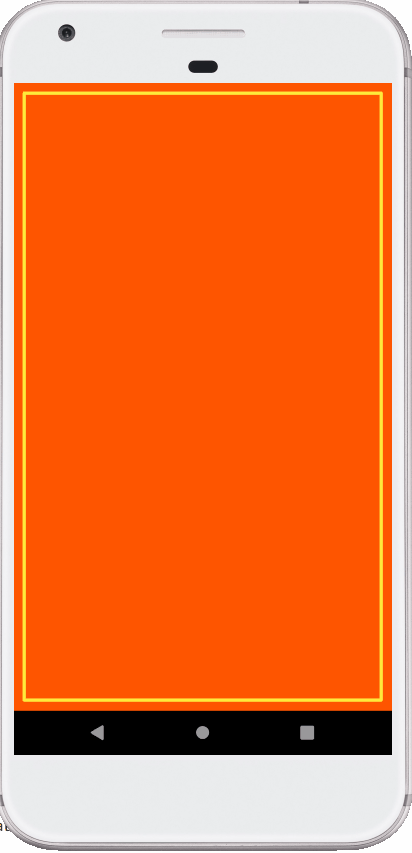

## Advanced Android with Kotlin - Udacity Course

### Lesson 4 - 2.2 Drawing on Canvas Objects

- Override `onSizeChanged()`
- Override `onDraw()`
- Set up `Paint`
- Initializ a `Path` object
- Touch events - `touchStart()`, `touchMove()`, `touchUp()`

## Demo

